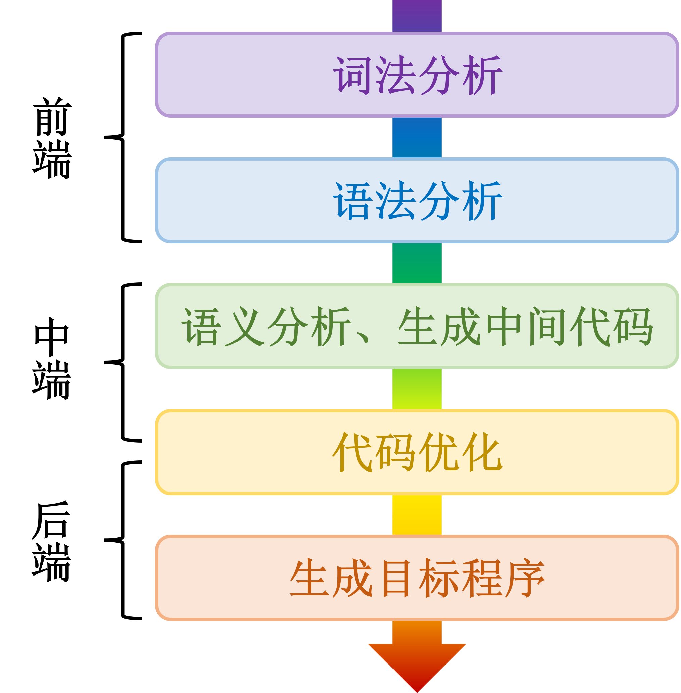
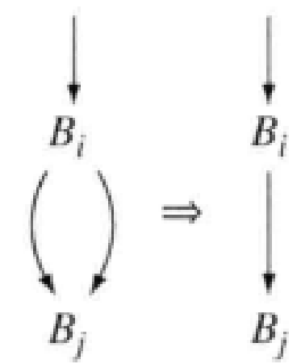
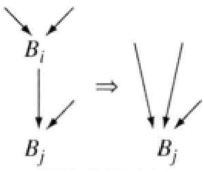
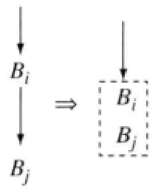
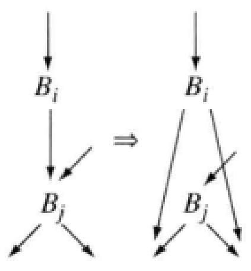

# ELYSIUM编译器设计文档

## 一、简介



1. **词法分析**：识别单词及其类别，在本实验中主要分为无意义字符（包括空白字符、注释）、单分界符、双分界符、无符号整数、标识符、字符串常量。
2. **语法分析**：根据语法规则识别语法成分，采用递归下降分析，需要消除左递归，通过向前看避免回溯。
3. **语义分析、生成中间代码**：基于语法分析得出的抽象语法树进行语义分析，构造符号表，进行错误处理，生成 $LLVM$  $IR$ 中间代码便于优化处理。  
4. **代码优化**：利用 $LLVM$  $IR$ 的 `value-user` 依赖关系，完成了mem2reg、死代码删除、函数内联、公共子表达式删除等机器无关优化。
5. **生成目标程序**：将 $LLVM$  $IR$ 翻译成与 $ARM$ 架构，然后进行寄存器分配和机器相关优化。  

## 二、中端

### 1、LLVM IR

本部分主要通过学习LLVM相关文档和源码实现中间代码。

 $LLVM$  $IR$ 采用**静态单赋值（SSA）**形式，类似三地址码，**每个值只有一个定义**，有助于实现 `def-use` 链，有助于后续编译器进行数据流分析和各种优化。同时， $LLVM$  $IR$​​ 实现存储中间代码的结构功能。以下主要关注指针类型，数组对象类型，`value`、`user`、`use`设计。

### 2、数组消除优化

该优化通过计算活跃 `load`、`store`、`memfuncs`，得到到达每个指令的 `store` 。

通过判断到达当前 `load` 的 `store` 是否匹配该 `load` 且覆盖了其他的所有 `load`，从而执行 `load` 替换。

同样，对于不能判断的 `load` ，可以对 `store` 计算一个冲突范围，对范围内的 `store` 增加使用次数。对于使用次数为0的 `store`，可以认为是没用的 `store` 。

对于如下的用例：

```cpp
int x[100];
int main(){
    x[1]=10;
    if(getint()>0){
        putint(x[5]);
        putint(x[1]);
        while(xxx){
            putint(x[2]);
        }
    }
    while(xxx){
        int index = getint();
        x[index] = 20;
        while(xxx){
            putint(x[index]);
        }
        if(cond){
            x[1] = 10;
            putint(x[1]);
        }
        putint(x[index]);
    }
}
```

可以优化为：

```cpp
int x[100];
int main(){
    x[1]=10;
    if(getint()>0){
        putint(0); //初始化为0，替换
        putint(10);//仅有一个store到达，替换
        while(xxx){
            putint(0);//x1到达域包含此处，且支配，可以替换
        }
    }
    while(xxx){
        int index = getint();
        x[index] = 20;
        while(xxx){
            putint(20);//x[index]覆盖其他store，可以替换
        }
        if(cond){
            x[1] = 10;
            putint(10);//x[1]覆盖其他store，可以替换
        }
        putint(x[index]);//x[1]和x[index]两处store可能冲突，无法替换
    }
}
```

### 3、`call`函数优化

我们从我们的编译结果中，发现了一种特别的IR模式：

```gas
block14:
	%16 = icmp slt i32 %num_param, 0
	br i32 %16, label %block9, label %block10
block9:
	ret float 0.0
block10:
	%20 = sub i32 %num_param, 1
	%24 = call float @func(float %data_param, i32 %20)
	%25 = fadd float %data_param, %24
	%29 = call float @func(float %25, i32 %20)
	%30 = fsub float %25, %29
	ret float %30
```

这种模式对应的函数判断一个参数（不妨设为参数 `a` ，顺序无关）是否小于0，小于0则返回0.0，否则将参数 `a` 减一，用这个参数递归调用自身，并传入另一个参数（不妨设参数 `b`）。

* 第一次递归调用自身，传入参数 `a` 和参数 `b`，结果驾到参数 `b` 上。
* 第二次递归调用自身，传入参数 `a` 和参数 `b`，结果从 `b` 中减去。

我们发现，可以用数学分析快速解决这种模式。

对于参数 `a`，小于0时返回0，等于0时由于下一次调用小于0，则返回参数 `b`。`a` 等于1时，`b` 分别变为 `b+b` ，再变为 `2b-2b=0` ，结果返回0。

对此，我们猜测该函数当参数 `a` 是奇数时返回0，偶数时返回参数 `b` ，并使用数学归纳法证明：

#### !! 数学归纳证明

其中 `a` 、`b` 为变量。“ `b` 变为 `x` ”意味着在后续的证明中，`b` 等于 `x`，直到下一次赋值。

* 假设对于奇数 `k` 作为参数 `a`，小于 `k` 的调用均符合上述规律，证明 `k` 也符合规律 
  * 由于第一次递归调用传入 `k-1`，根据假设返回0。因此参数 `b` 没有变化。 
  * 第二次递归调用传入 `k-1` ，根据假设返回0，因此参数 `b` 没有变化。 
  * 最后返回 `b`，符合规律。
* 假设对于偶数 `k` 为参数 `a` ，小于 `k` 的调用符合规律，证明 `k` 也符合规律
  * 由于第一次递归调用传入 `k-1` ，根据假设返回参数 `b` ，参数 `b` 变为 `2b`。
  * 由于第二次递归调用传入 `k-1` ，根据假设返回参数 `b` ，参数` b` 变为0。
  * 最后返回0，符合规律

综上所述，我们严格证明了我们的猜想。现在，它成为了定理，我们得以有理有据地对我们定义的 $IR$进行优化。

### 4、循环窥孔优化

该优化的对象是常见的loop求和并取模常数。

```cpp
sum = initsum;
i = 0;
while(i < maxindex){
    sum += x;
    sum %= remconst; //(remconst < 2^16)
}
use of sum...
```

我们可以将其优化为：

```cpp
if(i < maxindex){
    sum = (initsum%remconst)+
            ((maxindex-i)%const * x%const)%const;
else sum = initsum;
```

### 5、块重排优化

对于一个支配时，我们按照直接支配关系重新排序块的顺序。

我们的逻辑是一个块的后继被自己直接支配，则说明该后继的任何执行需要经过该块，则应当优先放在该块后面。

更优先考虑的是进入循环及进入循环体的块。我们假设它们进入的概率更大，需要优先放在该块后面。

对于其他被自己支配的块，只需要在优先考虑前序块的排布后，再考虑即可。

### 6、指令重排优化

这个优化的作用是减少后端寄存器分配的冲突边。

对于每个后端指令，尝试将其向前移动，如果发现移动后的冲突边数量减少，则实际执行该移动。

由于移动可能会产生新的可移动指令，我们用不动点算法重排直到达到不动点。

### 7、mem2reg

mem2reg将 `alloca`、`load`、`store`等变量声明使用相关内存操作转换为`phi`指令，减少了内存存取，同时也让后续图着色寄存器分配发挥更大效力。求解支配树没有采用迭代更新法，而是采用结点删除法。  

### 8、死代码删除

#### 控制流处理

- **合并冗余分支指令**

  

  在 `label1 = label2` 的条件下，将`br cond, label1, label2` 优化成 `br label1`。

- **删除空程序块**

  

  只包含一条跳转指令的基本块。

- **合并程序块**

  

  block只有一个前驱节点，且前驱节点以跳转指令结尾。

- **提升分支指令**

  

  若 $B_j$ 是空程序块且以分支指令结束，则将 $B_j$ 的前驱指令的跳转地址进行替换。

#### 删除死代码

- **删除无用函数**：删除没有被用到的函数，维护 `caller-callee` 关系即可。
- **删除不可达和无用指令**：采用广度优先搜索，将有副作用的函数调用、`ret`、`br` 和 `store` 这些有用指令集合作为初态，沿着 `def-use` 链不断扩充。  
- **删除荣誉的 `PHI` 指令**：

### 9、函数内联

1. 标记递归函数（不参与函数内联）

2. 对于每条函数调用指令（调用函数不包括递归调用）
   - 以 `call` 后为分界点，将 `call` 所在的基本块分成2个，同时更新前驱后继关系和 `phi` ；
   - 复制内联函数指令，插入到 `call` 前；
   - 将 `call` 替换为 `br` ，修正基本块前驱后继关系；
   - 处理内联函数中的 `ret` 指令，多个含返回值的 `ret` 指令合并成一条 `phi `指令；

### 10、局部公共子表达式删除

- 通过计算 `hashcode` 实现基本快内的公共子表达式删除。

### 11、全局常量传播

- 在生成目标代码时，若ir指令结果为常量，则映射到后端为一个立即数，当其他指令用到该指令时，获取该立即数即可。

## 三、后端

### 1、代码生成

后端大部分指令可以采用与中端类似的方法完成，比如中端的 `Binary.add` 对应 $ARM$ 和 $Riscv$ 的后端 `add` 指令等。其中针对**乘除法指令**做出如下特殊优化处理：

#### !! 算数优化

- 乘法优化
  - 对于常数乘以寄存器类型的指令，我们进行了优化处理。将立即数操作数进行了分解。我们认为如果乘数可以被分解为两个以内 `2^i` 之差或之和，那么他就可以被拆解为两条以内移位指令之积或者之和。
- 除法优化
  - 当被除数为常数时，我们进行了多类除法优化，对于除数为2的幂次的情况，我们直接转换为移位指令，对于其他情况，我们借助论文**《Division by Invariant Integers using Multiplication》**的方法将除法转换为多条乘法以及移位指令。

### 2、寄存器分配

#### ARM寄存器调用规范

> - 整数寄存器
>
>   ARM 32-bit架构的整数寄存器（R0~R15）使用的调用规范如下：
>
>   - **R0-R3**: 用于传递函数参数（前四个）和返回值。调用结束后，R0通常用来存放返回值。
>
>   - **R4-R11**: 被调用者保存（Callee-saved）寄存器。这些寄存器的内容在函数调用后应该保持不变。如果一个函数需要使用这些寄存器，它必须在使用之前保存它们，并在返回之前恢复它们。
>
>   - **R12 (IP)**: 临时寄存器，也叫作“intra-procedure-call scratch register”，可以在函数调用时临时使用。
>
>   - **R13 (SP)**: 栈指针，指向当前栈帧的顶部。
>
>   - **R14 (LR)**: 链接寄存器，保存返回地址。调用子程序时保存返回地址，函数结束时通常用`BX LR`来返回。
>
>   - **R15 (PC)**: 程序计数器，指向下一条执行指令。
>
> - 浮点数寄存器
>
>   对于ARM架构中的VFP (Vector Floating Point)寄存器，在32-bit ARM架构中有32个32-bit浮点寄存器（S0~S31），它们的调用规范如下：
>
>   - **S0-S15**: 用于传递浮点数类型的函数参数和返回值。根据具体的ABI，有时只使用S0-S7来传递参数。
>
>   - **S16-S31**: 被调用者保存（Callee-saved）寄存器。如果一个函数使用这些寄存器，它需要在使用前保存，并在返回前恢复。
>
> ---
>
> ##### 调用者保存寄存器（Caller-saved）
>
> 调用者保存寄存器是那些在函数调用时，调用者需要负责保存和恢复的寄存器。这意味着在调用子函数之前，调用者如果需要保留这些寄存器的值，则需要将其保存到堆栈或其他位置。
>
> - 整数寄存器:
>   - **R0-R3**: 用于传递参数和返回值。调用者在调用子函数时，必须假定这些寄存器会被子函数修改，因此如果需要保留其值，调用者需要在调用前保存这些寄存器的值。
>   - **R12 (IP)**: 也是一个临时寄存器，通常用作内部过程调用的临时存储。调用者也需要保存它的值。
> - 浮点数寄存器:
>   - **S0-S15**: 主要用于传递浮点参数和返回值。调用者需要在调用子函数之前保存它们的值。
>
> ##### 被调用者保存寄存器（Callee-saved）
>
> 被调用者保存寄存器是那些在函数调用过程中，被调用的函数（子函数）需要负责保存和恢复的寄存器。这意味着子函数可以在其内部自由使用这些寄存器，但在返回之前必须将这些寄存器的值恢复到它们在调用之前的状态。
>
> - 整数寄存器:
>   - **R4-R11**: 被调用者保存的寄存器。这些寄存器的内容在函数调用后应该保持不变。如果一个函数需要使用这些寄存器，它必须在使用之前保存它们，并在返回之前恢复它们。
> - 浮点数寄存器:
>   - **S16-S31**: 被调用者保存的寄存器。如果一个函数使用这些寄存器，它需要在使用前保存，并在返回前恢复它们。

**(1) 生成保护指令**

在每个非主函数的起始和结尾生成保护指令，确保被调用者保存（Callee-saved）寄存器的值在函数调用前后保持不变。

- **起始保护**:
  - 在函数的开始处，检查哪些被调用者保存的寄存器会被使用。如果函数将使用这些寄存器，则在使用这些寄存器之前生成`PUSH`或`STMFD`指令，将它们保存到栈中。
  - 对于浮点寄存器（如S16-S31），可以使用`VSTM`指令将它们保存到栈中。
- **结束恢复**:
  - 在函数结束处，在返回之前，生成相应的`POP`或`LDMFD`指令，将之前保存到栈中的寄存器值恢复到寄存器中。
  - 对于浮点寄存器，使用`VLDM`指令从栈中恢复它们的值。

**(2) 构造冲突图**

构造冲突图是寄存器分配过程中关键的一步，用于表示不同变量（或中间值）之间的冲突关系，即哪些变量不能分配到同一个寄存器。

- **节点表示**: 图中的每个节点代表一个变量或临时值。
- **边表示**: 如果两个变量在程序中同一时间活跃（live），即它们的生命周期重叠，则在它们之间画一条边，表示它们不能分配到同一个寄存器。
- **冲突检测**: 根据变量的生命周期，逐一检查它们在基本块中的活跃区间，添加相应的边。

**(3) 简化**

简化步骤通过逐步减少冲突图的复杂性，为后续的寄存器分配做准备。

- **节点剥离**: 在冲突图中，找到度数（连接的边数）小于可用寄存器数的节点。将这些节点从图中移除，并记录它们的移除顺序。
- **递归简化**: 重复上述过程，直到冲突图中的节点数无法再减少，即图中所有节点的度数都不小于寄存器数。这些剩余的节点可能会在后续步骤中引发溢出。

**(4) 溢出**

溢出步骤处理那些无法分配寄存器的变量或临时值。

- **选择溢出变量**: 如果冲突图中还存在高度冲突的节点（度数大于寄存器数），选择一个节点将其标记为溢出，即无法分配到寄存器，需要溢出到内存。
- **更新冲突图**: 将被标记为溢出的节点及其所有边从冲突图中移除，然后返回简化步骤，继续简化剩余的图。
- **内存溢出**: 在实际代码生成中，为溢出的变量生成加载（`LDR`）和存储（`STR`）指令，将它们的值存储在内存中，而不是寄存器中。

**(5) 选择**

选择步骤是实际将寄存器分配给变量的过程。

- **逆序分配**: 根据简化步骤记录的节点移除顺序，从最后一个移除的节点开始，逆序为每个节点分配寄存器。
- **冲突检测**: 在为每个节点分配寄存器时，检查其邻接节点（与其有边相连的节点），确保选择的寄存器不与任何邻接节点冲突。
- **寄存器回填**: 如果在分配过程中发现某个节点无法分配到寄存器，可以将其标记为溢出，重复溢出步骤，然后再进行选择。

#### !! 溢出到浮点数寄存器优化

在标准寄存器分配过程中，当所有整数寄存器（R0-R15）都被占用且无法再分配时，通常会将溢出的变量存储到内存中。然而，为了进一步优化性能，您引入了一个中间步骤，将溢出的整数寄存器的值暂时存储到浮点数寄存器中（S0-S31），直到浮点数寄存器也溢出。

通过这种溢出到浮点寄存器的优化，可以有效**减少频繁的内存访问**，尤其是在寄存器压力较大的情况下，利用ARM处理器的浮点数寄存器作为临时存储，提升程序的执行效率。

**(1)  检测整数寄存器溢出**

在寄存器分配过程中，监控整数寄存器的使用情况。当发现所有可用的整数寄存器已经被占用且当前还需要为新的变量分配寄存器时，触发溢出处理流程。

**(2) 检查浮点数寄存器的可用性**

在将溢出的整数值存储到内存中之前，首先检查浮点数寄存器的可用性：

- 如果发现仍有未使用的浮点数寄存器（如S0-S31），选择一个空闲的浮点数寄存器。
- 使用`VMOV`指令将溢出的整数寄存器的值移动到选定的浮点数寄存器中。例如，如果R4需要溢出且S16空闲，则执行 `VMOV S16, R4`。
- 标记这个浮点数寄存器为已用，并记录其当前存储的整数寄存器值的对应关系。

**(3) 更新冲突图和寄存器分配表**

- 将浮点数寄存器视为临时存储的延伸，并更新冲突图，使得原本在冲突图中涉及溢出整数寄存器的边关系反映到相应的浮点数寄存器上。
- 在寄存器分配表中，记录整数寄存器的值被暂存到哪个浮点数寄存器中，以便在需要时能够正确访问这些值。

**(4) 检测浮点数寄存器溢出**

随着程序的执行，如果浮点数寄存器也逐渐被填满，则进入下一步：

- 当所有浮点数寄存器都被占用时，开始将值溢出到内存中。
- 选择一个存储整数值的浮点数寄存器，使用`VMOV`指令将其值移动回某个空闲的整数寄存器（如`VMOV R4, S16`），然后通过`STR`指令将这个整数值存储到内存中。
- 将该浮点数寄存器释放，供将来的溢出使用。

**(5) 在需要时恢复值**

- 在恢复溢出的变量时，首先检查其是否暂存在浮点数寄存器中。如果是，则使用`VMOV`指令将其恢复到整数寄存器中。
- 如果该值已经溢出到内存，则使用`LDR`指令从内存中加载回来。

### 3、窥孔优化

#### i. 数据流窥孔

- 在寄存器分配之前

##### (1) 分支指令生成

后端指令生成的一个难点在于分支指令，原因是中端与后端分支指令处理的不一致。

对于中端，分支指令往往表现为 `ICMP`（ `FCMP` ）后接一条 `Branch`，但经过优化之后，两条指令会出现不连续现象。而对于后端，在$ARM$ 中，引入了条件码，需要两者之间连续，或者中间只有 `mov `等不影响条件码的语句。对于 $Riscv$ 理想情况下则是使用 `blt`、`bge`、`beq`、`bne`直接进行处理。

值得一提的是，在本次中端优化之后，还会有不符合SSA形式的 `MOVE` 指令，穿插在比较指令与分支指令之间，所以我们采用了比较指令先利用 $Riscv$ 的 `slt` 指令以及 $ARM$ 的条件赋值指令赋值，然后`parse`分支指令时再取出该值进行比较的方式，然后再在最后的窥孔时，根据指令情况决定是否合并为理想情况。

##### (2) 无用赋值语句删除

若后端生成指令的 `defReg` 没有被其他指令使用，则删除本条语句。

##### (3) 取Label简化

基于**局部性原理**，在程序执行过程中，通常会集中访问数组中的某些元素。这种访问模式可能导致在局部区域内生成大量的`Label`指令，用于多次获取同一个数组元素的地址。然而，实际上，我们只需执行一次`Label`指令，将该地址加载到寄存器中，并保持该寄存器的长期活跃状态。这样一来，后续对该数组元素的访问都可以直接通过寄存器来进行，从而避免频繁的地址加载操作，大幅提高程序的执行效率。

#### ii. 基础窥孔

##### (1) 同寄存器转移删除

删除 `mv rs, rs` 指令。

##### (2) 加减指令去零

将 `add/sub rd,rs,0` 指令优化成 `mv rd, rs` 指令。

##### (3) 内存同地址存取简化

基于对存储和读取操作的合理简化。如果一条指令在某个内存地址存入一个值后，紧接着又从同一内存地址取出该值进行运算，这样的操作会导致不必要的存取内存延迟。通过分析可以发现，在这种情况下，我们可以取消存入内存的指令，而直接使用当前寄存器中已经存储的值。这不仅减少了内存访问的次数，还提高了指令执行的效率，同时也减轻了寄存器和内存之间数据传输的负担。

##### (4) 栈指针寄存器化简

将修改指针寄存器 `sp` 的指令 `add sp,sp,rs` 的寄存器 `rs` 在前方有反复进行了 `addi/subi` 指令则可以修改成 `add sp,sp,imm` 。

##### (5) 加减指令合并

将多条 `add/sub` 指令合并成一条。

##### (6) `call`指令栈增减简化

将 `call` 指令前后关于压栈出栈的 `sp` 地址的增减语句，删除无用的寄存器赋值。

##### (7) 无用块转移删除

将如下的代码：

```gas
block0:
	add	r0,r1,r2
	j	block1
block1:
	add	r0,r1,r2
block2:
	add	r0,r1,r2
```

优化成：

```gas
block0:
	add	r0,r1,r2
	add	r0,r1,r2
block2:
	add	r0,r1,r2
```


